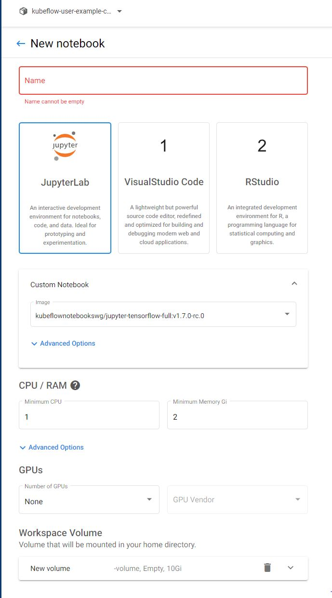
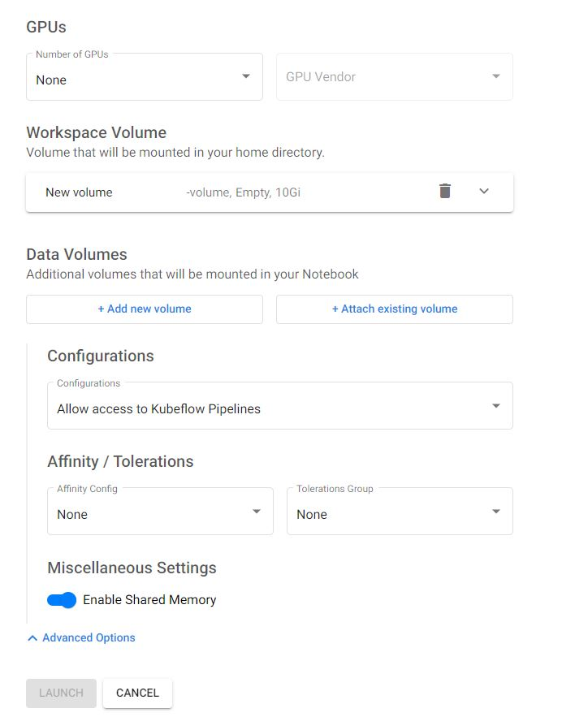

# How to create a kubeflow notebook and run pipelines from it

## Create a notebook

In order to create a Notebook go to **Notebooks** in Kubeflow UI and create a **New Notebook**



Next, you will have to name the **Notebook** and then select an image for Notebook (if you want to use a specific image).

**NOTE:** From what I tested, `kubeflownotebookswg/jupyter-tensorflow-full:v1.7.0-rc.0` worked pretty good.

Next, you will need to select the **CPU** and **RAM** for your notebook. Depending on your need and environment, you can select a value.

**NOTE:** It works okay for small tasks with default values!

After this, you can select a **number of GPUs** (if you have) and then create/modify the **Workspace Volume** and the **Data Volumes**.

**NOTE:** If you want your **NOTEBOOK TO ACCESS KUBEFLOW PIPELINES**, then select in the **advanced options** the configuration for **Allow access to Kubeflow Pipelines**.



## Enter your notebook

After you have created your notebook, you will have to wait until it is in **Running** state, then you can connect to it.

In the notebook, you will have to select terminal and run the following command:

```bash
# Install kfp (kubeflow pipelines) package for python
pip install kfp==1.8.12
```

**NOTE:** The suggested version is 1.8.12 or above.

## Create your kubeflow pipeline

After you have everything set, you can create a `Jupyter Notebook` and create your code for running a pipeline, or just drag and drop your `.ipynb` file in there and run it.

**NOTE:** You can add the [mnist_kfp.ipynb](../Pipelines/mnist_kfp.ipynb) file and then run the code to create your first pipeline.